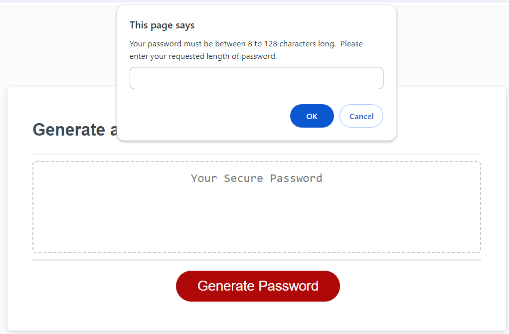
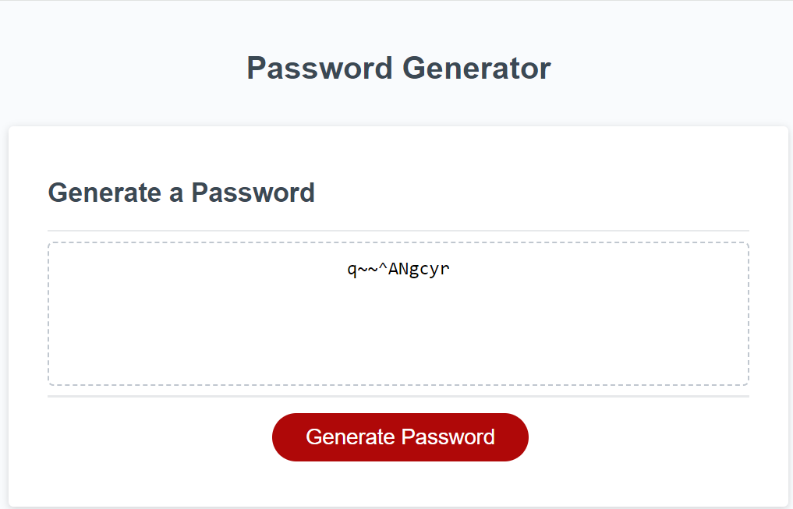

Password Generator Project

Password generator that has preset values for capital and lower case letters, numbers, and pre-determined special characters.  User inputs the quantity of characters they would like their password to be and the generator will deliver it.

Criteria is set between 8-128 letters long and the user must input a number in this range.  If outside the category or NaN, it will prompt the user of the criteria/what they need to do to get to the confirm messages for the rest of the criteria.

First prompt after clicking generate password.

Final prompt after entering "10" and clicking generate password.

Github link:

Live URL link:

